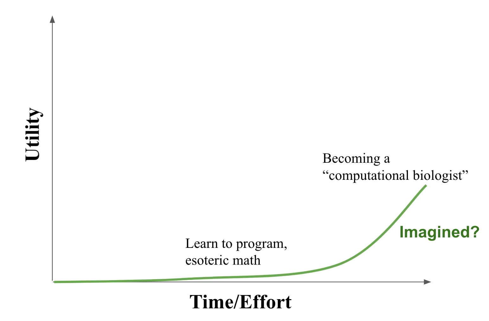
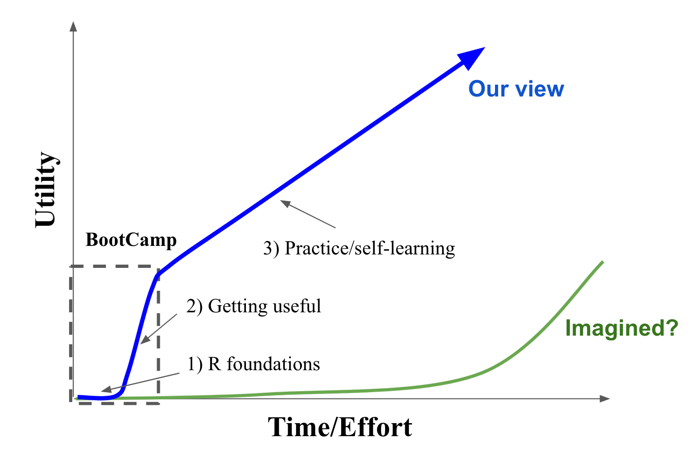

```{r setup, include=FALSE}
knitr::opts_chunk$set(echo = TRUE)
library(learnr)
tutorial_options(exercise.timelimit = 10, exercise.blanks = "___+")
```

## Welcome!

<center>

</center>


## Why learn to code as a cancer researcher?

- **Reproducible** data analysis: 
 
  - Document and share exactly how you analyzed your data

- Do more with your analysis, more efficiently:

  - More control and flexibility

  - Use community-created analysis tools

  - Leverage cancer data resources (often large datasets)

  - Create awesome visualizations


  
## Imagined learning curve
<center>

</center>

## Our view of the learning curve
<center>

</center>


## Course goals

- Get everyone past 'valley of despair' in R learning curve

- Convince you that R is an accessible and useful tool for you in your research

- Prepare you to tackle BootCamp projects next week 

- Get you excited to keep developing these coding skills!


## Why R specifically 

<center>

</center>

::: {style="font-size: 80%; text-align: left;"}

**Upsides**

- Free

- Great for data analysis and visualization

- LOTS of bioinformatics/stats tools available

**Downsides?**

- It's a hodge-podge

- Not the best for engineering software

:::


## Quick demo

<!-- Could walk through some juxtaposition with Excel based analysis here. Either specific to this example analysis or general -->

[LIVE DEMO]


## Strategy of the course

- **What this course is**

  - Coding basics
  
  - Heavy emphasis on practical skills (data wrangling, visualization)

  - Flagging areas with technical depth but giving the ‘need-to-know'

- **What this course is not**

  - Intro to computer science 
  
  - Intro to stats
  

## Course format

- **Presentations**: lecture style: present key concepts

- **Practice workbooks**: Hands-on practice with small groups

- **Weekend homework assignments**: 1 each weekend 

- **Resources**

  - TAs: (James, Ashir) plus: Jason Kwon, Aviad Tsherniak, Phil Montgomery, William Colgan

  - Course website: [broad.io/cp_r_bootcamp](cds.team/CP_R_bootcamp)
  
  - Slack #[cancer-bootcamp_r](https://broadinstitute.slack.com/archives/C02ERPL3P5F)

<!-- ## Schedule -->

## Other helpful R resources
 
- Hadley Wickham's R for Data Science [e-book](https://r4ds.had.co.nz/)

- R [cheet sheets](https://www.rstudio.com/resources/cheatsheets/)

- Rafael Irizarry's [R e-book](https://rafalab.github.io/dsbook/index.html)

- and much more...


## Acknowledgements

- Chester Ismay's DataCamp [slides](https://ismayc.github.io/talks/ness-infer/slide_deck.html#1)

- HBC Intro to R [course](https://hbctraining.github.io/Intro-to-R/schedules/1.5-day.html)

- Sam Meier's 2018 R lectures

- Hadley Wickham's R for Data Science


<!-- ## We need your help -->

<!-- - Your feedback is very much appreciated (Slack, email, etc) -->

<!-- - We'll do our best to adapt as we go. -->


# R Basics

<!-- ## Key Tools  -->

<!-- <center> -->
<!--  -->
<!-- </center> -->

<!-- - **R Markdown/Notebooks** -->

<!--   - Sort of like a lab notebook for analysis -->

<!--   - Easily share results and methods in different formats -->

<!--   - Encourages good code and analysis practices -->


<!-- ## R Studio review -->

<!-- Quick live demo of how to interact with Rstudio -->

<!-- - Different components of Rstudio interface -->

<!-- - R scripts vs Rmd files -->

<!-- - Running code lines -->

<!-- - Running code chunks -->

<!-- - Creating new chunks -->

## The R console

Where the action happens!

- Provide inputs to R
  
- See outputs of commands you give it (each on separate line)

- Web-based R consoles (Rstudio coming soon!)

```{r r_console, exercise = TRUE, exercise.eval = FALSE}

```

<!-- ## Create project directory -->

<!-- - Organize your work as 'Projects' in Rstudio -->

<!-- - Each project has a separate folder, with data, code, results. -->

<!-- - Copy the R_BootCamp_2019 folder from Google Drive to your computer -->

<!-- - Create a 'Project' in Rstudio -->
  


## R as calculator

List of key math operations

- `*`: multiplication
- `/`: division
- `+`: addition
- `-`: subtraction
- `^`: 'raise to the power'

## Logical operations

- `==` Check equals
- `!=` Check not equals
- `>` Greater than, `<` less than
- `>=` Greater than or equal to, etc.

```{r r_logicals, exercise = TRUE, exercise.eval = FALSE}
2^2 == 3
```


## Objects in R

- **Variables**: 

  - Store information/data (the "nouns")
  - Come in a number of flavors 

- **Functions**:

  - Set of instructions to perform some task (the "verbs")
  - We'll come back to these in a bit

## Creating variables

- You can create new variables with `<-`

```{r var_create, exercise = TRUE, exercise.eval = FALSE}
x <- 3 * 4
x
```

<!-- - All object-creation statements have the form: -->
<!--   - `object_name <- value` -->

<!-- ```{r obj_create, exercise = TRUE, exercise.eval = FALSE} -->
<!-- color1 = 'red' -->
<!-- color2 <- 'red' -->
<!-- color1 == color2 -->
<!-- ``` -->

<!-- - You can use `=`, but `<-` makes for better R code -->

<!-- - Use Rstudio shortcut 'Alt' + '-' -->


## Variable types in R {.smaller}

**Numbers**

```{r, eval = FALSE}
x <- 1
x <- 1.592E-39
```

**Strings (text)**

```{r, eval = FALSE}
x <- 'abc'
x <- "abc"
```

**Logical (true/false)**

```{r, eval = F}
x <- TRUE
x <- FALSE
x <- T
```

**Factors (categorical variables)**
  
- e.g. ('bad', 'OK', 'good', 'great')

- We will mostly try to avoid these, but be aware of them.


## Variable naming

- Variable names must start with a letter, and can only contain letters, numbers, '`_`', and '`.`'. 

Not allowed: `4th`, `my var`, `weird?`, etc. etc.

- Object naming is **important** for writing good, readable, code

- Make variable names descriptive

`avgClicks`

- Make function names verbs

`calculate_avg_clicks`

NOT: `var1` or `a`

<!-- ## Use comments! -->

<!-- - Code readability is huge so others can understand what you've done -->

<!--   - Including future you! -->

<!-- - In RMarkdown docs, write descriptive text before each code chunk -->

<!-- - Also good to add comments to key lines of code within chunks -->


<!-- ## R environment -->

<!-- - See info on current variables -->

<!-- - Clearing variables -->

<!-- - View data tables, etc. -->

<!-- **Practice** -->


# Commonly used R data structures

- Vectors

- Lists

- Matrix

- Dataframes


## Vectors {.smaller}

- Ordered collection of values. Like a sequence of 'buckets'

- Can hold numeric data

<center>

</center>

- Or text (strings)

<center>

</center>

- Or boolean data (TRUE/FALSE)

<center>

</center>

- **All data in a vector has to be the same type!**


## Making vectors

Use 'combine' function `c()`

```{r c_function, exercise = TRUE, exercise.eval = FALSE}
num_vec <- c(1, 2, 3, 4)

log_vec <- c(TRUE, TRUE, FALSE, F)

str_vec <- c('this', 'is', 'a', 'vector', 'of', 'strings')

print(num_vec)
```

Shorthand to create a sequence of integers

```{r range, exercise = TRUE, exercise.eval = FALSE}
1:4
```


## Missing values

- Quick notes on missing values in R (will be important)

- `NA` ('not available') is a special value for missing data that can be included in any type of vector

```{r NA_intro, exercise = TRUE, exercise.eval = FALSE}
c(1, 2, NA)
c('a', 'b', NA)
```


## Adding more data on to vectors {.smaller}

`c()` can also be used to add new elements to a vector

```{r c_function_cont, exercise = TRUE}
string_vec <- c("TP53", "PLEC", "DSPP", "PIK3CA")
string_vec2 <- c(string_vec, "BRAF")
string_vec2
```


Combining two vectors

```{r combine_vec_function, exercise = TRUE, exercise.eval = FALSE}
string_vec <- c("TP53", "PLEC", "DSPP", "PIK3CA")
string_vec2 <- c("BRAF", "EGFR", "DUSP4")
c(string_vec, string_vec2)
```


## Lists 

Lists are basically like relaxed vectors, where elements don't have to be the same type

```{r list_intro}
z <- list('a', 1, TRUE)
z
```

---

You can combine lists with the `c()` function as with vectors

```{r}
z <- list('a', 1, TRUE)
c(z, 'c')
```


## Matrix

- Like vectors, but arranged in 2d with rows and columns

<center>

</center>

- Example: gene expression values across genes and samples 


## Dataframe

- Most common way of interacting with data

- Each column is a vector, and they can hold different kinds of data

- Like an Excel table. 

<center>

</center>


## Key concepts recap

<!-- - Use RMarkdown documents like an experiment notebook -->

- Create variables with `<-`, naming them is important

- Variables can be numbers, text (strings) or TRUE/FALSE (boolean)

- Data organized as vectors, lists, matrices, and dataframes

- Create/add to vectors (or lists) with `c()`

- Make lists with `list()`


