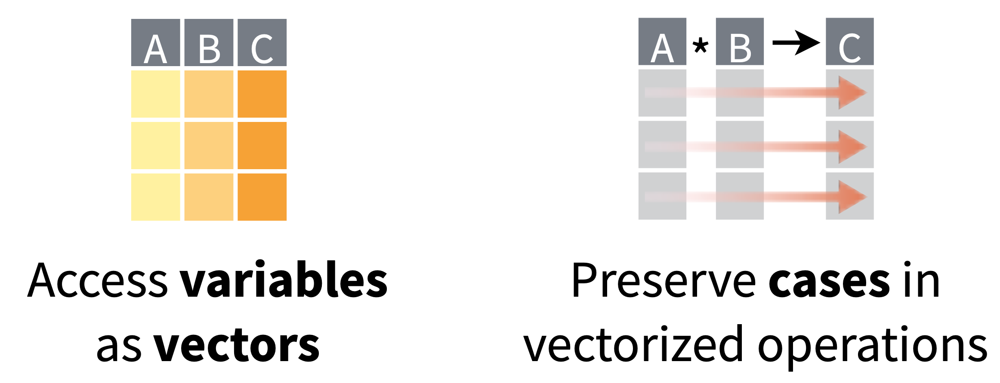
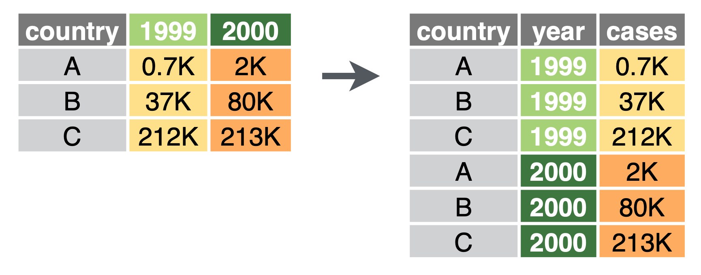

```{r setup, include=FALSE}
library(learnr)
library(magrittr)
library(tidyverse)
library(gapminder)
library(knitr)
library(kableExtra)
knitr::opts_chunk$set(echo = TRUE, warning = FALSE, message = FALSE)
tutorial_options(exercise.timelimit = 60, exercise.blanks = "___+")

#beautify table printout
pretty_table <- function(table, max_rows = 10, max_cols = 10) {
  if (nrow(table) > max_rows) {
    table <- table %>% head(max_rows)
  } 
  if (ncol(table) > max_cols) {
    table <- table[, 1:max_cols]
  }
  kable(table) %>%
  kable_styling(c('striped', 'hover'), full_width = F, position = 'left')
}
```


## Overview

- Topic 1: Formatting data the 'tidy' way

- Topic 2: How to combine datasets

# Tidy Data

```{r, include = FALSE}
#create some untidy datasets
gp_1 <- gapminder %>% 
  mutate(gdp = pop * gdpPercap) %>% 
  dplyr::select(country, continent, year, pop, gdp)
gp_2 <- gp_1 %>% 
  gather(-c(country, continent, year), key = 'type', value = 'value') %>% 
  arrange(country, year)
gp_3 <- gp_1 %>% 
  mutate(gdp = round(gdp),
         gdpPercap = paste0(gdp, '/', pop)) %>% 
  select(-c(pop, gdp))
gp_4 <- gp_1 %>% 
  filter(year < 1970) %>% 
  select(country, year, gdp) %>% 
  spread(key = year, value = gdp)
```

## Tidy data


1) Each variable forms a column.

2) Each observation forms a row.

3) Each type of observational unit forms a table

## Why tidy data?



- Standardized framework for structuring data

- Works well with R tools


## Return of gapminder {.smaller}


```{r, echo = FALSE}
head(gp_1, 3) %>% pretty_table
```

```{r, fig.width = 4.5, fig.height = 3}
gp_1 %>% 
  mutate(gpdPerCap = gdp / pop) %>% 
  filter(country %in% c('Serbia', 'Spain', 'Turkey')) %>% 
  ggplot(aes(year, gpdPerCap, color = country)) + 
  geom_line()
```

## Is this data tidy?

```{r, echo = FALSE}
head(gp_2, 4) %>% pretty_table()
```

## Is this data tidy?

```{r, echo = FALSE}
head(gp_2, 4) %>% pretty_table()
```

- What would it take to plot gdpPercap vs year?


## Is this data tidy?

```{r, echo = FALSE}
head(gp_3, 4) %>% pretty_table()
```


## Is this data tidy? 

```{r, echo = FALSE}
head(gp_4, 4) %>% pretty_table()
```


## Untidy data

“Happy families are all alike; every unhappy family is unhappy in its own way.” –– Leo Tolstoy

“Tidy datasets are all alike, but every messy dataset is messy in its own way.” –– Hadley Wickham

- Most common causes of 'non-tidy' data:

1) One variable is spread across multiple columns

2) One observation is scattered across multiple rows


## Tidyr package: two key functions {.smaller}

- `pivot_longer`



- `pivot_wider`


## Pivot_longer 

- When column names are not names of variables, but *values* of a variable

```{r}
head(gp_4) %>% pretty_table()
```


## Pivot_longer {.smaller}

- Want to collapse 'value columns' into a new pair of variables, one to store the variable in the column names, the other to store the variable spread out over cells in the table

- Need to specify:
  
  - `cols`: The set of columns that represent values not variables

  - `names_to`: The name of the variable whose values form column names 
  
  - `values_to`: The name of the variable whose values are spread over the cells (called the `value`)
  


## Pivot_longer {.smaller}

Starting from a table with the year value distributed across columns

```{r}
head(gp_4) %>% pretty_table()
```
## Pivot_longer {.smaller}

Use pivot longer to consolidate these year columns into a single variable called `year`

```{r}
gp_4 %>% 
  pivot_longer(cols = c('1952', '1957', '1962', '1967'), names_to = 'year', values_to = 'gdp') %>% 
  pretty_table()
```

## Pivot_longer {.smaller}

- Can also specify which rows *not* to include

```{r, eval = FALSE}
gp_4 %>% 
  pivot_longer(cols = !c('country'), names_to = 'year', values_to = 'gdp') %>% 
  pretty_table()
```

- Or can specify a range of rows

```{r, eval = FALSE}
gp_4 %>% 
  pivot_longer(cols = c('1952':'1967'), names_to = 'year', values_to = 'gdp') %>% 
  pretty_table()
```

- [read more](https://tidyselect.r-lib.org/reference/language.html) about ways to specify column selections


## Pivot_wider {.smaller}

- `pivot_wider()` is the opposite of `pivot_longer()`

- Increases columns, decreases rows

- Use it when an observation is scattered across multiple rows

- In this case, the population and gdp values for each observation are on separate rows.


## Pivot_wider {.smaller}

To use `pivot_wider()` you need to specify:

  - `names_from`: The column containing the variable names. Here it's `type`
  
  - `values_from`: The column containing the values from multiple variables (the `value` column). Here it's `value`


```{r}
gp_2 %>% pretty_table()
```

## Pivot_wider {.smaller}

```{r}
gp_2 %>% 
  pivot_wider(names_from = 'type', values_from = 'value') %>% 
  head(5) %>% 
  pretty_table()
```


## separate

When multiple variables are encoded in a single column

```{r}
gp_3 %>% pretty_table()
```

## separate {.smaller}

`separate` splits them into two new columns

```{r}
gp_3 %>% 
  separate(col = gdpPercap, into = c('gdp', 'pop'), sep = '/', convert = TRUE) %>% 
  head(5) %>% 
  pretty_table()
```

- `convert = TRUE` ensures that the resulting gdp and pop variables are treated asnumeric rather than strings


## separate {.smaller}

- You can also split values of a column by 'position'

```{r}
gp_1 %>% 
  separate(col = year, into = c('century', 'year'), sep = 2) %>% 
  head(5) %>% 
  pretty_table()
```

<!-- Maybe tidyr refs here? -->

# Combining data tables

## Combining data tables

- Concatenate by rows (assume same columns)

- Concatenate by columns (assume same rows)

- Merge (`join`) tables with different kinds of info.


## Row concatenation {.smaller}

`bind_rows`

Split data into separate tables by year and then recombine by row concatenation
```{r}
gpmind_1962 <- gapminder %>% filter(year == 1962)
gpmind_1972 <- gapminder %>% filter(year == 1972)
gpmind_1977 <- gapminder %>% filter(year == 1977)

#combine them by pasting together rows
gpmind_row_comb <- bind_rows(gpmind_1962, gpmind_1972, gpmind_1977)
gpmind_row_comb %>% 
  group_by(year) %>% 
  summarise(n = n()) 
```


## Column concatenation {.smaller}

Split into two tables by column 
```{r}
gpmind_loc <- gapminder %>% select(country, continent)
gpmind_data <- gapminder %>% select(lifeExp, pop, gdpPercap)

head(gpmind_loc, 3) %>% pretty_table()

head(gpmind_data, 3) %>% pretty_table()

```

---

- `bind_cols` pastes together the columns

```{r}
bind_cols(gpmind_data, gpmind_loc) %>% 
  head(3) %>% 
  pretty_table()
```

- **This is dangerous** (don't do it)!! Assumes the rows are aligned..


## Merging tables {.smaller} 

- It's generally not possible to simply paste together tables by row or column because they don't "line up"

- Say we have a table of country 'codes', and we want to add this information to our gapminder table

```{r}
country_codes %>% 
  head(4) %>% 
  pretty_table()
```

- Not easy if we were to try to use `bind_cols`!


## Use a `join` {.smaller}

Matches rows of the two tables based on the values of `country`.

```{r}
gapminder %>% 
  left_join(country_codes, by = 'country') %>% 
  head(4) %>% 
  pretty_table()
```


## Elements of a join:

- Need to have (at least) one variable in common between two tables

  -Specify this variable (or set of variable) in the 'by' argument
  
- Need to specify how you want it to handle matches


## Joining by multiple values {.smaller}

```{r, echo = FALSE}
cont_year <- tibble(continent = c('Asia', 'Europe', 'Africa', 'Asia', 'Oceania'),
                    year = c(1962, 1992, 1972, 2002, 1982),
                    some_stat = c(1, 2, 3, 4, 5))
```

How can we add this info, specific to the continent and year, to our original table?

```{r, echo = FALSE}
cont_year %>% pretty_table()
```


## Joining by multiple values {.smaller}

Easy: you can just specify multiple fields to match by

```{r}
gapminder %>% 
  inner_join(cont_year, by = c('continent', 'year')) %>% 
  head(4) %>% 
  pretty_table()
```

<!-- #EXAMPLES OF JOINING BY MULTIPLE COLUMNS, INNER/OUTER? -->


## Additional references

- [Hadley Wickham's paper](https://vita.had.co.nz/papers/tidy-data.pdf)

- [cheat sheet](https://github.com/rstudio/cheatsheets/blob/master/tidyr.pdf)

- [tidyr pivot docs](https://tidyr.tidyverse.org/articles/pivot.html)

- https://ismayc.github.io/talks/ness-infer/slide_deck.html#85


