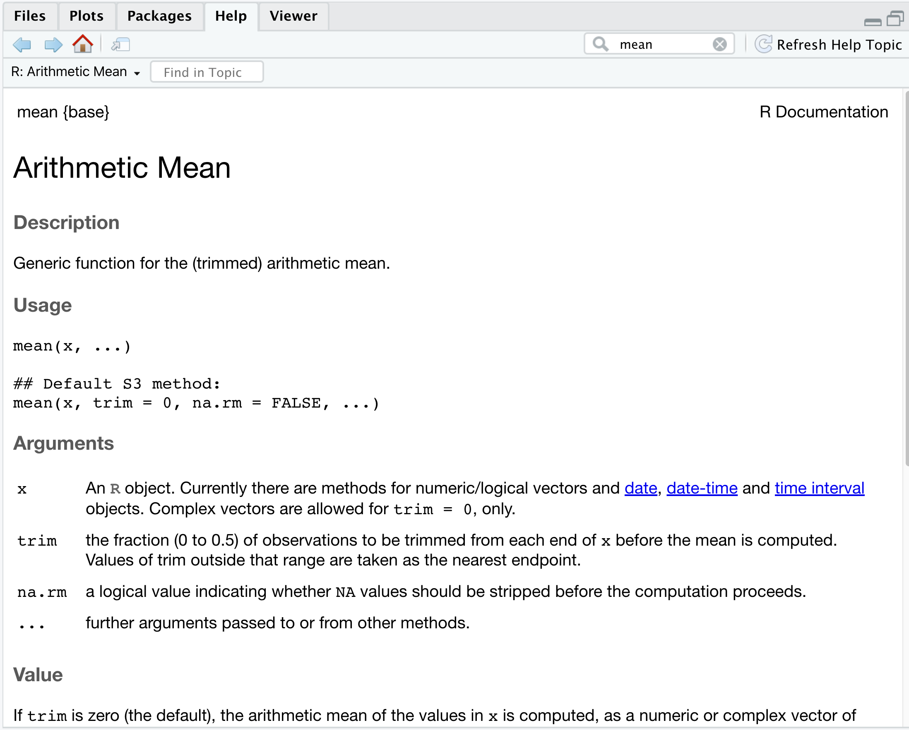
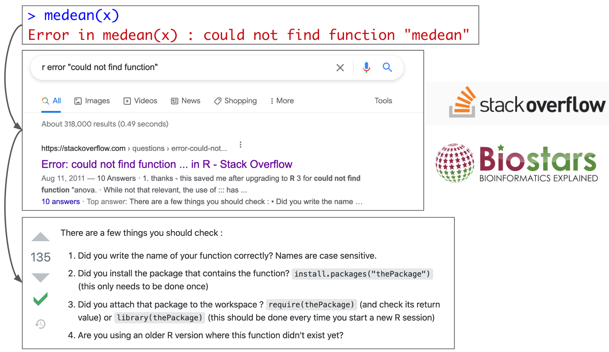

```{r setup, include=FALSE}
knitr::opts_chunk$set(echo = TRUE,
                      comment = "")
library(tidyverse)
```

## 

<center>Press the "?" key for tips on navigating these slides</center>

# Functions

## What are functions?

- Self-contained modules of code that accomplish a specific task

```{r, eval = FALSE}
output <- do_the_thing(input1, input2)
```

- Inputs (**arguments**) can include:

  - The objects on which the function acts
  
  - Additional arguments that specify how the function acts


## Example functions 

Calculating mean of a vector

```{r function_example}
mean(1:10)
```
    
-   Functions do not have to provide output, or take inputs

Save data to a file (no output)

```{r, eval = FALSE}
save(object_to_save, file = 'data_file')
```

Get 'working directory' (no input needed)

```{r, eval = TRUE}
getwd()
```

# Built-in functions

## Mathematical functions 

Functions that operate on individual values:

  - `sqrt()`
  - `abs()`
  - `log()`
  - `exp()` 

```{r math_functions_scalar, exercise = TRUE}

```

## Mathematical functions 

Functions that estimate statistics across a set of values:
  
  - `mean()`
  - `median()`
  - `max()`

```{r math_functions_summary, exercise = TRUE}
x <- c(1, 1, 2, 3, 5, 8, 13)

```


## Getting help 

- Understanding how to get help effectively is the most important skill!

```{r, eval = FALSE}
?my_function
help(my_function)
```

- Or use the `Help` tab in RStudio to search.


## Example help documentation




## Function help

Documentation is typically divided into sections.

- `Description`

- Example `Usage`

- What are the inputs (`Arguments`)?

- What does it return (`Value`) ?

- Some inputs are optional (and have default settings). Look at the `signature`


## Tips on using functions

- Use tab-complete to quickly check function inputs.

- Best to name arguments explicitly (at least the optional ones)

```{r positional_arg_example, exercise = TRUE}
round(pi, digits = 2) 
```

See examples of function being used!

```{r example_func, eval = FALSE}
example('round')
```

## The 'combine' function

What are the inputs and outputs?

```{r combine_eg}
glengths <- c(4.6, 3000, 580)
```


## Creating functions (the general pattern)

```{r, eval = FALSE}
name_of_function <- function(argument1, argument2) {
    *code that does something based on inputs*
    return(some_results)
}
```

- `function` is a special keyword for creating functions

- Assign the function to a variable (give it a name)

- List inputs ('arguments')

- Use curly braces to wrap text that performs some action on any inputs

- (Optionally) `return` a value from the function


## Creating functions (a simple example)

```{r user_def_func, exercise = TRUE}

combine_two_numbers <- function(num1, num2) {
  result <- num1 + num2
  return(result)
}

combine_two_numbers(1, 2)
```

Don't forget to `return` a result


## Making 'optional' inputs

Assign a default value to inputs with `=` to make them optional

```{r optional_params, exercise = TRUE, exercise.eval = FALSE}
subtract_from_vec <- function(data_vec, subtract_val = 1) {
  new_data_vec <- data_vec - subtract_val
  return(new_data_vec)
}
test_vec <- 1:10
subtract_from_vec(test_vec)
subtract_from_vec(test_vec, subtract_val = 2)
```


## Returning values

What does this do?

```{r ret_val, exercise=TRUE}
center_vec <- function(data_vec, midpoint = 0) {
  new_data <- (data_vec - mean(data_vec)) + midpoint
}
```


# Packages

## What are packages?

- Collections of functions, and data, designed to add specific functionality beyond 'base R'

- Need to install before you can use (only do this once)

```{r install_pkg, eval = FALSE}
install.packages('tidyverse')
```

- Load the package into your R session (**do this every session**)

```{r load_pkg, eval = FALSE}
library(tidyverse)
```


## Getting help with packages

- Use the `help` function

```{r, eval = FALSE}
help(package = 'lubridate')
```

- Use the `Packages` tab in Rstudio


## Quick note on Bioconductor

- CRAN is the default 'app store' for R packages

- Bioconductor is another that has many useful bioinformatics related packages

<center>

</center>

```{r bioManager, eval = FALSE}
install.packages("BiocManager")
BiocManager::install("GenomicRanges")
```

- (Looks weird, but just copy-paste)

- Once installed they're just like other packages

```{r biocmanager_pkg, eval = FALSE}
library(GenomicRanges)
```


## Word of warning about function names

- Multiple packages can have the same names for different functions.

- Which one R thinks you're using in a given instance can be hard to know.

- Cause of many painful "bugs"

- When in doubt it's best to specify which package the function comes from:

```{r pkg_namespace-setup, eval = FALSE}
library(lubridate)
library(here)
lubridate::here()
here::here()
```


## Getting more help

- Pay attention to error messages and warning messages

- Using Google 

  - Search error messages verbatim (but remove stuff specific to your usage).
  
  - Add "r" "error"

- Stackoverflow: almost every problem you encounter is answered here (often 10 different ways!)


## Google -> StackOverflow {.big-picture}




# Key concepts recap

Using functions:

`output <- do_a_thing(input_obj, param1 = my_val)`

Writing your own functions:

```{r, eval = FALSE}
do_a_thing <- function(input_obj, param1) {
  **STUFF**
  return(result)
}
```

- Getting help with functions: `help(my_fun)`.

- `install.packages()` and `library()` to install/use packages

- Google (and stackoverflow, Biostars, etc.) are your friends!

# Now for hands-on practice!

- Go to [R Bootcamp](https://ashirborah.github.io/Bootcamp_R_tutorials/)

- Work through Lesson 1 and 2 Practice

- Ask questions if you get stuck

- Use slack for Q&A


## Tips for RMD Notebooks

- Your work in each code chunk is **independent** (results don't carry over)

- You can reset the whole notebook by clicking `Session` -> `Restart R and cleat outputs`

-   When you are done, click the `Knit` button to create the html output