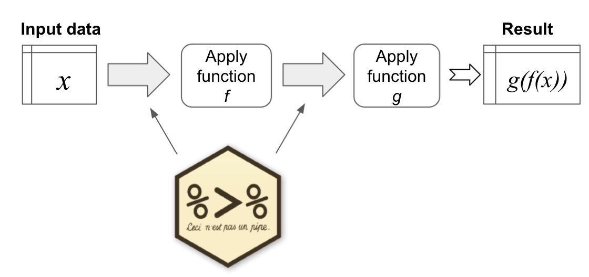

```{r setup, include=FALSE}
knitr::opts_chunk$set(echo = TRUE, warning = FALSE, message = FALSE)
library(tidyverse)
library(gapminder)
```

## Recap (key concepts so far)

- Variables, data types and data structures in R

- Functions (using, getting help, making your own)

- Loading and saving data

- Using Rstudio, Projects, and Markdown notebooks

- Working with data in vectors, lists, matrices, and dataframes (tables)


# Data Wrangling

## Data Wrangling

- Much of data analysis can be viewed as taking some datasets (the 'nouns') and applying a series of transformations (the 'verbs')

- These transformations are nessecary to create the format needed to create outputs (plots, summary tables etc.)

- The nouns are typically 'tibbles' (could be matrices, vectors or lists).

- The verbs are functions

- Today we'll learn about the key 'verbs' for wrangling tables


## The Tidyverse


-   Read more [here](https://www.tidyverse.org/packages/)
-   Tidy data convention:
    -   Rows = Observations/Samples
    -   Columns = Variables/Measurements

## Pipes

We often want to apply multiple functions ('verbs') to our data in a chain.



<!--  -->

`%>%` is a special R symbol for chaining together functions (part of `tidyverse`)


## Pipe Example

```{r, eval = FALSE}
#Very hard to read
bop(scoop(hop(foo_foo, through = forest), up = field_mice), on = head)

#creating unnecessary 'temporary' variables
foo_foo_1 <- hop(foo_foo, through = forest)
foo_foo_2 <- scoop(foo_foo_1, up = field_mice)
foo_foo_3 <- bop(foo_foo_2, on = head)
```

Using pipes makes your code easy to read and understand as a series of verbs 
```{r, eval = FALSE}
foo_foo %>%
  hop(through = forest) %>%
  scoop(up = field_mice) %>%
  bop(on = head)
```

## Pipe Example

Assigning the results of a chain to a new variable

```{r, eval = FALSE}
result <- input_data %>% function_1 %>% function_2
```


The pipe feeds the *first* argument of the next function

```{r}
x <- c('a', 'b', 'c')
x %>% c('d')
```

If you want the piped input to feed a different argument, you can use `.`:

```{r}
x %>% c('d', .)
```


## Why use pipes

- Code is easier to read (and modify)

- This style of coding is less prone to errors due to misplaced parentheses associated with nested function calls

- Using pipes is a choice! Use it when it's helpful

- Note: Rstudio keyboard shortcut: Cmd + shift + M


# Data wrangling verbs

## Key data wrangling verbs

dplyr package 

  - `filter`
  
  - `select`
  
  - `arrange`
  
  - `mutate`
  
  - `summarise`
  
  - `group_by`

## Gapminder package

```{r, include = FALSE}
library(tidyverse)
```

```{r, ref.label="gapminder_setup"}
```

```{r gapminder_setup}
#install.packages('gapminder')
library(gapminder)
```

```{r show_gapminder}
head(gapminder)
```


## Filter

- Select a subset of the rows from a tibble

- Arguments are the 'filters' you'd like to apply

```{r gapminder_year_filter}
gapminder %>% filter(year == 2007)
```

- Use `==` to pick rows with variable equal to a specified value.

## Logical operators for filtering

- Use `,` to check for multiple filters being true ('AND')

```{r gapminder_multiple_filter}
gapminder %>% 
  filter(year == 2002, continent == "Asia") %>% 
  sample_n(4)
```


## Logical operators for filtering

- Use `|` to check for any in multiple filters being true ('OR')

```{r gapminder_or_filter}
gapminder %>% 
  filter(year == 2002 | continent == "Asia") %>% 
  sample_n(4)
```


## Logical operators for filtering

- Use `%in%` to check if value is contained in a specified set

```{r gapminder_membership_filter}
gapminder %>% 
  filter(country %in% c("Argentina", "Belgium", "Mexico"),
         year %in% c(1987, 1992))
```


## Select 

- Use `select` to pick a subset of columns by name

```{r gapminder_select}
gapminder %>% 
  select(country, year, lifeExp) %>% 
  head(4)
```

## Handling Columns with Non-standard Names

-   Select columns with non-standard names 
    -   Starts with number, special character or contains spaces
-   Use back-ticks (**not** single quotes), tab complete column names will do this for you

```{r gapminder_select_improper_names, eval = FALSE}
df %>% select(`1999`, `variable with spaces`)
```

## Rename

- Use `rename` to rename certain columns
    -   Expected format: new name = old name

```{r gapminder_rename}
gapminder %>% 
  rename(lifeExpectancy = lifeExp, population = pop) %>% 
  head(3)
```

- Note that any column names you don't include are left unchanged


## Arrange

- Reorder rows based on the values of one or more variables

```{r gapminder_arrange}
gapminder %>% 
  arrange(year) %>% 
  head(4)
```

## Arrange

- Sorting by multiple variables

```{r gapminder_arrange_multiple}
gapminder %>% 
  arrange(year, lifeExp) %>% 
  head(4)
```


## Desc

- Can also sort in descending order

```{r gapminder_desc_arrange}
gapminder %>%
  filter(year > 2000) %>%
  arrange(desc(country)) %>%
  head(4)
```


## Mutate

- **Create a new variable with a specific value**
- Create a new variable that is a function of existing variables
- Overwrite the contents of an existing variable
  
```{r gapminder_mutate}
gapminder %>% 
  mutate(just_one = 1) %>% 
  head(4)
```

## Mutate

- Create a new variable with a specific value 
- **Create a new variable based on other variables**
- Overwrite the contents of an existing variable
  
```{r gapminder_mutate_arithmetic}
gapminder %>%
  mutate(gdp = pop * gdpPercap) %>% 
  head(4)
```


## Mutate

- Create a new variable with a specific value 
- Create a new variable based on other variables
- **Overwrite the contents of an existing variable**
  
```{r gapminder_mutate_change_var}
gapminder %>%
  mutate(pop = pop/1e6) %>% 
  head(4)
```

## Mutate and ifelse 

```{r}
x <- 10
ifelse(x > 9, "x is greater than 9", "x is not greater than 9")
```

Allows you to use mutate in a 'condition-dependent' way

```{r}
gapminder %>% 
  mutate(adjusted_gdp = ifelse(year < 1980, gdpPercap * 2, gdpPercap)) %>% 
  sample_n(5)
```


## Summarise

- Apply a numerical summary to a column of a table

```{r gapminder_summarise}
gapminder %>% 
  filter(year == 1997) %>% 
  summarise(max_exp = max(lifeExp),
            sd_exp = sd(lifeExp))
```

- Works with any functions that take a vector as input and return a single value


## Group_by

- Combined with `summarise`, `group_by` allows you to summarise data for each possible value of a categorical variable

```{r gapminder_groupby}
gapminder %>% 
  filter(year == 1997) %>% 
  group_by(continent) %>%
  summarise(max_exp = max(lifeExp),
            sd_exp = sd(lifeExp))
```

## Group_by {.smaller}

- Can be applied to combinations of variables

```{r gapminder_groupby_multiple}
gapminder %>% 
  group_by(continent, year) %>%
  summarise(num_rows = n(),
            max_exp = max(lifeExp),
            sd_exp = sd(lifeExp)) %>% 
  head(4)
```

- `n()` function counts number of rows in each group


# Recap


[dplyr cheat sheet](https://4.files.edl.io/b9e2/07/12/19/142839-a23788fb-1d3a-4665-9dc4-33bfd442c296.pdf)

## Additional resources

- [dplyr intro](https://dplyr.tidyverse.org/articles/dplyr.html)

- [DataCamp Slides](https://ismayc.github.io/talks/ness-infer/slide_deck.html#13
)
- More on pipes: [DataCamp](https://www.datacamp.com/community/tutorials/pipe-r-tutorial), 
[TowardsDataScience](https://towardsdatascience.com/an-introduction-to-the-pipe-in-r-823090760d64)
