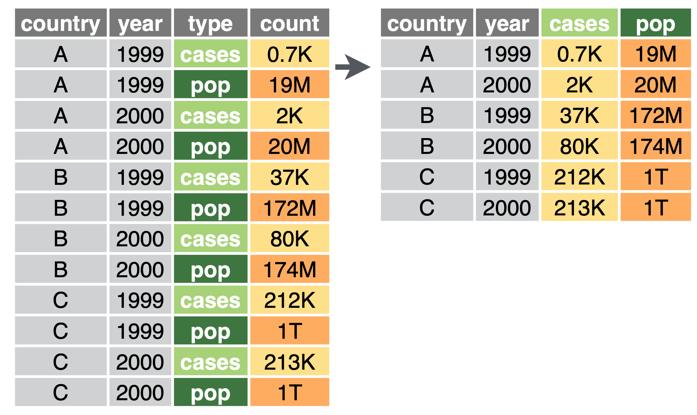
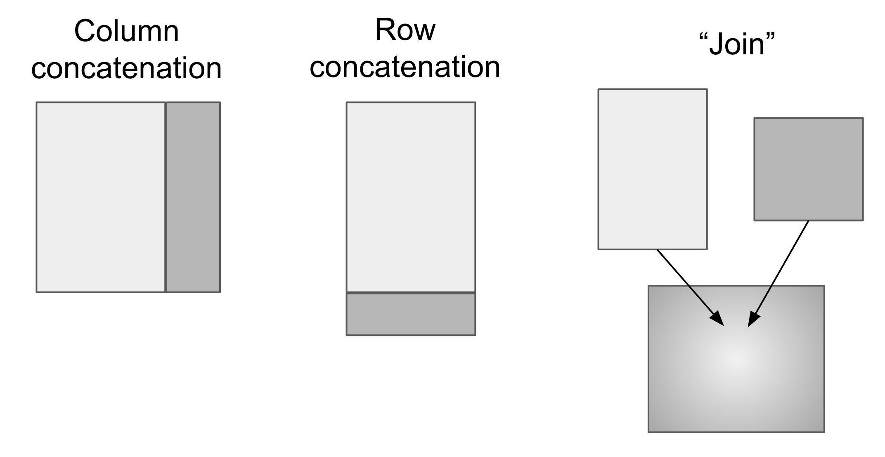

```{r setup, include=FALSE}
library(magrittr)
library(tidyverse)
library(gapminder)
library(knitr)
library(kableExtra)
knitr::opts_chunk$set(echo = TRUE, warning = FALSE, message = FALSE)

#beautify table printout
pretty_table <- function(table, max_rows = 10, max_cols = 10) {
  if (nrow(table) > max_rows) {
    table <- table %>% head(max_rows)
  } 
  if (ncol(table) > max_cols) {
    table <- table[, 1:max_cols]
  }
  kable(table) %>%
  kable_styling(c('striped', 'hover'), full_width = F, position = 'left')
}
```


# Overview

- Topic 1: Transforming data

- Topic 2: Combining data

# Transforming data

```{r, include = FALSE}
#create some untidy datasets
gp_1 <- gapminder %>% 
  mutate(gdp = pop * gdpPercap) %>% 
  dplyr::select(country, continent, year, pop, gdp)
gp_2 <- gp_1 %>% 
  gather(-c(country, continent, year), key = 'type', value = 'value') %>% 
  arrange(country, year)
gp_3 <- gp_1 %>% 
  mutate(gdp = round(gdp),
         gdpPercap = paste0(gdp, '/', pop)) %>% 
  select(-c(pop, gdp))
gp_4 <- gp_1 %>% 
  filter(year < 1970) %>% 
  select(country, year, gdp) %>% 
  spread(key = year, value = gdp)
```

## Tidy data


1.    Each variable must have its own column.
2.    Each observation must have its own row.
3.    Each value must have its own cell.

All tidyverse packages use the tidy data format 

## Why tidy data?


- Standardized framework for structuring data

- Works well with the tidyverse packages


## Return of gapminder 


```{r, echo = FALSE}
head(gp_1, 3) %>% pretty_table
```

```{r, fig.width = 4.5, fig.height = 3}
gp_1 %>% 
  mutate(gpdPerCap = gdp / pop) %>% 
  filter(country %in% c('Serbia', 'Spain', 'Turkey')) %>% 
  ggplot(aes(year, gpdPerCap, color = country)) + 
  geom_line()
```

## Is this data tidy?

```{r, echo = FALSE}
head(gp_2, 4) %>% pretty_table()
```

## Is this data tidy?

```{r, echo = FALSE}
head(gp_2, 4) %>% pretty_table()
```

- What would it take to plot gdpPercap vs year?


## Is this data tidy?

```{r, echo = FALSE}
head(gp_3, 4) %>% pretty_table()
```


## Is this data tidy? 

```{r, echo = FALSE}
head(gp_4, 4) %>% pretty_table()
```


## Untidy data

“Happy families are all alike; every unhappy family is unhappy in its own way.” –– Leo Tolstoy

“Tidy datasets are all alike, but every messy dataset is messy in its own way.” –– Hadley Wickham

- Most common causes of 'non-tidy' data:

1) One variable is spread across multiple columns

2) One observation is scattered across multiple rows


## Tidyr package: two key functions 

- `pivot_longer`


- `pivot_wider`




## pivot_longer() 

- When column names are not names of variables, but *values* of a variable
```{r, echo=TRUE, eval = FALSE}
head(gp_4)
```

```{r, echo=FALSE}
head(gp_4) %>% pretty_table()
```


## pivot_longer() {.small-bullets}

-   Transforms multiple 'value columns' into a longer format by collapsing them into two new columns:
    -   **Name column**: Holds the original column names as values
    -   **Value column**: Contains the data spread across the original columns

- Need to specify:
  
  - `cols`: The set of columns that represent values not variables

  - `names_to`: The name of the variable whose values form column names 
  
  - `values_to`: The name of the variable whose values are spread over the cells (called the `value`)
  


## pivot_longer() 

Starting from a table with the year value distributed across columns

```{r, echo=TRUE, eval = FALSE}
head(gp_4)
```

```{r, echo=FALSE}
head(gp_4) %>% pretty_table()
```

## pivot_longer() 

Use pivot longer to consolidate these year columns into a single variable called `year`

```{r, eval=FALSE, echo=TRUE}
gp_4 %>% 
  pivot_longer(cols = c('1952', '1957', '1962', '1967'), names_to = 'year', values_to = 'gdp') 
```

```{r, echo=FALSE, eval=TRUE}
gp_4 %>% 
  pivot_longer(cols = c('1952', '1957', '1962', '1967'), names_to = 'year', values_to = 'gdp') %>% 
  head() %>%
  pretty_table()
```


## pivot_longer() 

- Can also specify which rows *not* to include

```{r, eval = FALSE}
gp_4 %>% 
  pivot_longer(cols = !c('country'), names_to = 'year', values_to = 'gdp') 
```

- Or can specify a range of rows

```{r, eval = FALSE}
gp_4 %>% 
  pivot_longer(cols = c('1952':'1967'), names_to = 'year', values_to = 'gdp') 
```

- [read more](https://tidyselect.r-lib.org/reference/language.html) about ways to specify column selections


## pivot_wider() 

- `pivot_wider()` is the opposite of `pivot_longer()`

- Increases columns, decreases rows

- Use it when an observation is scattered across multiple rows

- In this case, the population and gdp values for each observation are on separate rows.


## pivot_wider() 

To use `pivot_wider()` you need to specify:

  - `names_from`: The column containing the variable names. Here it's `type`
  
  - `values_from`: The column containing the values from multiple variables (the `value` column). Here it's `value`


```{r, echo = FALSE}
gp_2 %>%
  head() %>%
  pretty_table()
```


## pivot_wider() 

```{r, eval=FALSE}
gp_2 %>% 
  pivot_wider(names_from = 'type', values_from = 'value') %>% 
  head(5) 
```
```{r, echo=FALSE}
gp_2 %>% 
  pivot_wider(names_from = 'type', values_from = 'value') %>% 
  head(5) %>% 
  pretty_table()
```


## separate

When multiple variables are encoded in a single column

```{r, echo=FALSE}
gp_3 %>% pretty_table()
```

## separate 

`separate` splits them into two new columns

```{r, eval=FALSE}
gp_3 %>% 
  separate(col = gdpPercap, into = c('gdp', 'pop'), sep = '/', convert = TRUE) %>% 
  head(5) 
```
```{r, echo=TRUE}
gp_3 %>% 
  separate(col = gdpPercap, into = c('gdp', 'pop'), sep = '/', convert = TRUE) %>% 
  head(5) %>% 
  pretty_table()
```

- `convert = TRUE` ensures that the resulting gdp and pop variables are treated as numeric rather than strings


## separate 

- You can also split values of a column by 'position'

```{r}
gp_1 %>% 
  separate(col = year, into = c('century', 'year'), sep = 2) %>% 
  head(5) %>% 
  pretty_table()
```


# Combining data frames

## Combining data frames

- Concatenate by rows (assume same columns)

- Concatenate by columns (assume same rows)

- Merge (`join`) data frames with different kinds of info.



## Row concatenation 

- `bind_rows`

Split data into separate data frames by year and then recombine by row concatenation
```{r}
gpmind_1962 <- gapminder %>% filter(year == 1962)
gpmind_1972 <- gapminder %>% filter(year == 1972)
gpmind_1977 <- gapminder %>% filter(year == 1977)

#combine them by pasting together rows
gpmind_row_comb <- bind_rows(gpmind_1962, gpmind_1972, gpmind_1977)
gpmind_row_comb %>% 
  group_by(year) %>% 
  summarise(n = n()) 
```


## Column concatenation 

Split into two data frames by column 
```{r, eval=FALSE}
gpmind_loc <- gapminder %>% select(country, continent)
gpmind_data <- gapminder %>% select(lifeExp, pop, gdpPercap)

head(gpmind_loc, 3)
head(gpmind_data, 3) 
```

```{r, echo=FALSE}
gpmind_loc <- gapminder %>% select(country, continent)
gpmind_data <- gapminder %>% select(lifeExp, pop, gdpPercap)

head(gpmind_loc, 3) %>% pretty_table()
head(gpmind_data, 3) %>% pretty_table()
```

## Column concatenation 

- `bind_cols` pastes together the columns

```{r, eval=FALSE}
bind_cols(gpmind_data, gpmind_loc) %>% 
  head(3) 
```
```{r, echo=FALSE}
bind_cols(gpmind_data, gpmind_loc) %>% 
  head(3) %>% 
  pretty_table()
```

**This is dangerous** as it assumes the rows are in the same order so avoid this method.


## Merging data frames  

- It's generally not possible to simply paste together data frames by row or column because they do not "line up"

- Say we have a table of country 'codes', and we want to add this information to our gapminder table

```{r}
country_codes %>% 
  head(4) %>% 
  pretty_table()
```


## Use a `join` 

Matches rows of the two data frames based on the values of `country`.

```{r, eval=FALSE}
gapminder %>% 
  left_join(country_codes, by = 'country') %>% 
  head(4) %>% 
  pretty_table() |>
  scroll_box(width = "100%")
```

```{r, echo=TRUE}
gapminder %>% 
  left_join(country_codes, by = 'country') %>% 
  head(4) 
```


## Elements of a join:

- Need to have (at least) one variable in common between two data frames

    - Specify this variable (or set of variable) in the 'by' argument
  
- Need to specify how you want it to handle matches


## Visualizing joins


## Joining by multiple values 

```{r, echo = FALSE}
cont_year <- tibble(continent = c('Asia', 'Europe', 'Africa', 'Asia', 'Oceania'),
                    year = c(1962, 1992, 1972, 2002, 1982),
                    some_stat = c(1, 2, 3, 4, 5))
```

How can we add this info, specific to the continent and year, to our original table?

```{r, echo = FALSE}
cont_year %>% pretty_table()
```


## Joining by multiple values 

Easy: you can just specify multiple fields to match by


```{r, eval=FALSE}
gapminder %>% 
  inner_join(cont_year, by = c('continent', 'year')) %>% 
  head(4) 
```

```{r, echo=FALSE}
gapminder %>% 
  inner_join(cont_year, by = c('continent', 'year')) %>% 
  head(4) %>% 
  pretty_table()
```


# Recap

## Transforming Data

-   Tidy Data Principles:

    -   Each variable has its own column.
    -   Each observation has its own row.
    -   Each value has its own cell.
-   Data Transformation:

    -   `pivot_longer()`: Transforms wide data into long format.
    -   `pivot_wider()`: Transforms long data into wide format.
    -   `separate()`: Splits single columns with combined data into multiple columns.
    -   `unite()`: Combines multiple columns into a single column.
    
## Combining Data

-   Concatenation:
      -   `bind_rows()`: Concatenates data frames by rows (for same columns).
      -   `bind_cols()`: Concatenates data frames by columns (for same rows).
-   Joining Data:

      -   `left_join()`, `right_join()`, `inner_join()`, `full_join()`: Merge data frames based on common keys.
      -   Joins allow matching by one or multiple columns to combine data sets efficiently.

# Additional references

- [Hadley Wickham's paper](https://vita.had.co.nz/papers/tidy-data.pdf)

- [cheat sheet](https://github.com/rstudio/cheatsheets/blob/master/tidyr.pdf)

- [tidyr pivot docs](https://tidyr.tidyverse.org/articles/pivot.html)

- https://ismayc.github.io/talks/ness-infer/slide_deck.html#85


